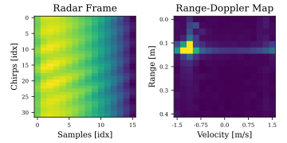
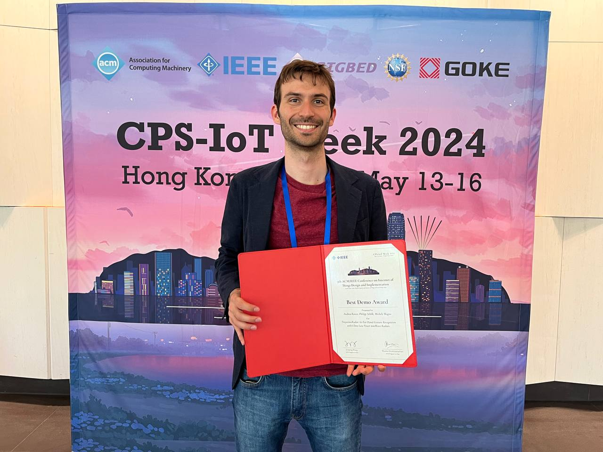

Long time no see! In fact, it would be more appropriate to start with "well met!", since this is my first post since the very beginning. (Note: this is only partially true, I had the default first-post from the template online for quite a while :smile:)

Today I figured to write a few lines about a work that ironically ended up marking both the start and the end of a professional and personal chapter. Today I wanna tell you about our latest paper, published at the _International Conference on Internet of Things Design and Implementation (IoTDI 24)_.
This work was in fact initially developed in 2021 during my Master's Thesis at *ETH Zürich*. Later, as I joined the *Center for Project-Based Learning* (from now on: PBL) the work was kinda forgotten, until rather recently when I decided to clean up some dust, give it a new coat of shiny paint and submit it to what was to be my last conference representing PBL.

In a nutshell, this is how **TinyssimoRadar: In-Ear Hand Gesture Recognition with Ultra-Low Power mmWave Radars** came to life.

### TinyssimoWhat?
The idea behind this project was as simple as it was fascinating: making our interactions with devices more natural and intuitive. Picture this: instead of fumbling around with buttons or touchscreens, you can simply wave your hand to control your gadgets. Potentially you could even control you devices with subtle finger gestures. Some applications could indeed benefit more than others from such type of interface, but at least this was the oveall vision.
In general, though, the core idea was to explore in more details the potential of mmWave radars for this kind of task, and what could be built on top of this technology.
This idea was most notably explored by Google in 2015 with their relatively notorious *Project Soli* ([here's a video](https://www.youtube.com/watch?v=0QNiZfSsPc0) in case you missed it).

*Tinyssimo* (italianized superlative of Tiny) however refers to the most relevant contribution of this work, which was bringing all of this (application/technology/idea) into a very constrained device, both in terms of size (that's why we chose the form factor of an earbud), but especially in terms of energy budget and computational power.

### Radars, old friends
There are in fact sooo many types of radars that it would take a full lecture to cover them all. However, the methods used in this work are not really very radar-specific, hence it is enought to have a very broad idea of the working principles. If you feel like crawling deeper in the rabbit hole, check out [this website](https://www.radartutorial.eu/index.en.html).
For the others, it is enought to understand that we used a specific class of radar called Frequency Modulated Continuous Wave (FMCW), which allow us to measure at the same time distance and velocity of a moving object.
This dual capability makes FMCW radars particularly effective for precise gesture recognition, as they can capture the movement of the hand with relative precision. With the dark powers of the *Fourier Transform* we can then transform the rather messy and confusing radar signal into a more meaningful (and rather artistic!) *Range-Doppler Map*, as seen the the figure below.

### 3D prints, CNNs and Super Glue
To make the magic happen and interpret the funny doppler maps into hand gestures, we recurred to another dark spell known to the masters of the Arcane as *Convolutional Neural Networks*. These algorithms are quite excellent indeed, and despite being quite old, they still dominate most of the Computer Vision technology and similar tasks.
In our work we used a 3-stage model where a first CNN is used on single, instantaneous radar data, and a second one that observes the evolution of the radar signal in time.
The main benefit of this architecture is memory and computation efficiency, which were strong requirements given the constrains of our tiny platform.
If you are interested in the algorithmic side, feel free to check out the project on PBL's [Github](https://github.com/ETH-PBL/TinyssimoRadar).

To make things tangible and fun to play with, we decided to put this technology (in fact applicable to more or less any device) into a tiny earbud, as previously mentioned.
This came with the added benefit of being able to use an already existing hardware platform called [VitalCore](https://github.com/ETH-PBL/VitalCore), previously developed by the excellent [Philipp](https://schilk.co/) for earlier earbud fun.
Ironically, a considerable amount of the time was probably spent on the 3D design of the case, sourcing of the correct batteries and assembly of the final prototype, held together by a judicious amount of superglue (the savvy engineer knows that judicious is a synonim of "loads").
Overall we were quite happy with the final demo device, have a look for yourself!

### The Award and Farewells
I presented both the paper and the demo personally at IoTDI24 in Hong Kong in May this year, and I was quite happy of the positive feedback and overall response that we received for this project. Apparently also the organizers appreciated the efforts, and congratulated us with the *Best Demo Award*.

Overall I am quite happy about how this project concluded. It was fun and exciting during my Master's Thesis of course, and it was rewarding again in the last few months leading up to the conference.
I bid farewell to PBL in May to start a new adventure, so this experience also marked the (official) end of a fun two years and a half.
Of course it also stirred up some emotions, particularly as I wrapped everything up with somewhat the very thing that started it all.

